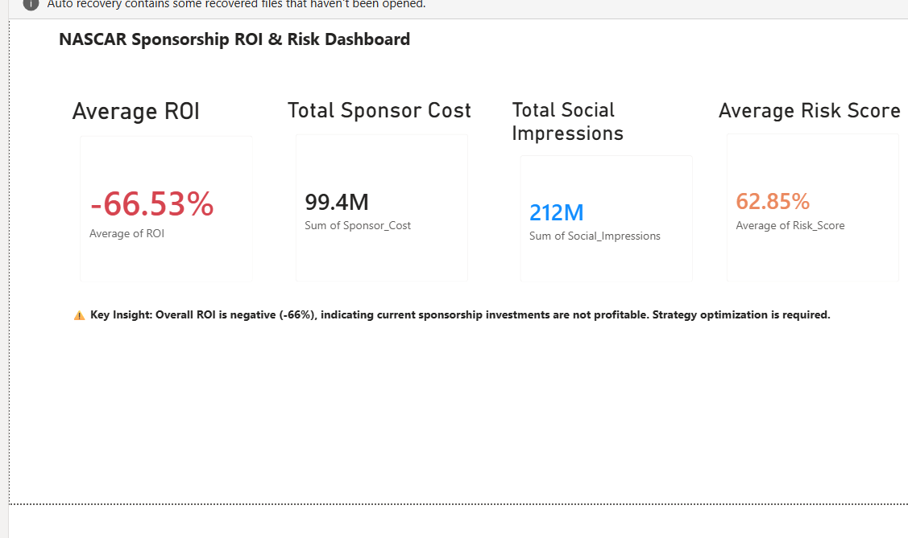
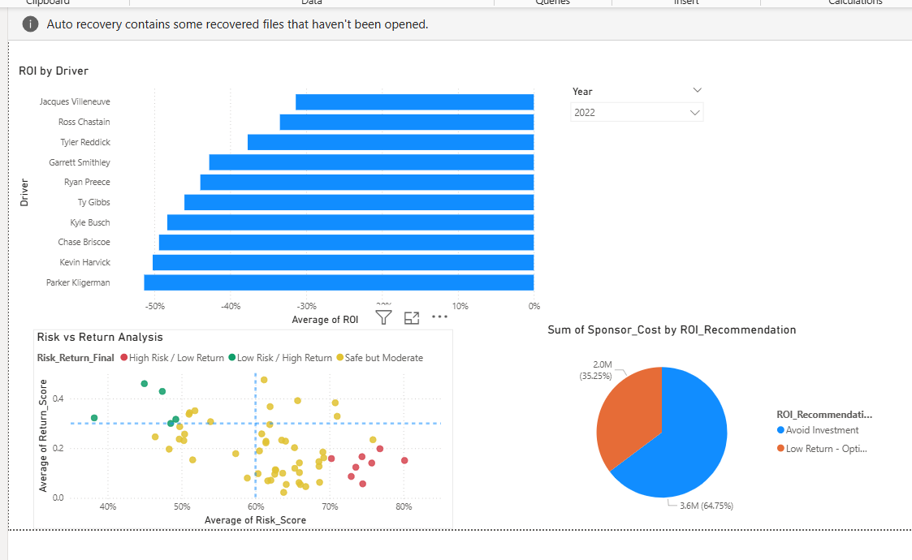
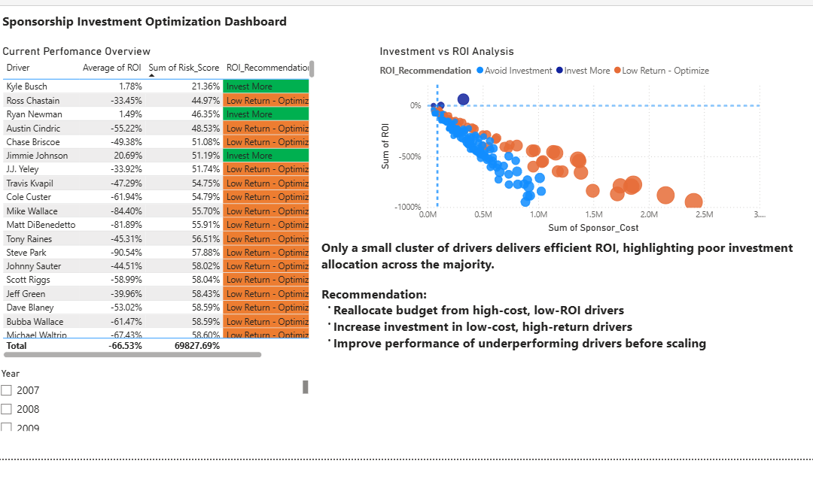

# 📊 NASCAR Sponsorship ROI Investment Analytics Dashboard

> End-to-end analytics solution built using Python, SQL Server, 
> and Power BI to help stakeholders identify where to invest, 
> monitor or reduce NASCAR sponsorship spending.

---

## 🚀 Project Summary

Most NASCAR sponsorship decisions are made on gut feeling.
This project replaces guesswork with data analyzing driver 
performance, sponsorship costs, and ROI to give stakeholders 
clear, actionable investment recommendations.

**Bottom line:** High investment does NOT guarantee high ROI.
This dashboard proves it with data.

---

## 🛠️ Tech Stack

| Tool | Purpose |
|------|---------|
| Python (Google Colab) | Data cleaning, ETL, feature engineering |
| SQL Server | Data extraction and querying |
| Power BI | Interactive dashboard and visualization |
| Pandas / NumPy | Data transformation |

---

## 📊 Dashboard Pages

### 🔹 Page 1 — Overview
- Total sponsorship spend vs total ROI
- Driver performance rankings
- Budget allocation breakdown

### 🔹 Page 2 — Risk vs Return Analysis
- Scatter plot of investment vs ROI per driver
- Identifies high-cost,low-return drivers
- Highlights efficient vs inefficient spending

### 🔹 Page 3 — Recommendations
- **Invest More** → Drivers with proven high ROI
- **Avoid Investment** → High cost,low ROI drivers
- **Optimize** → Moderate performers needing strategy change

---

## 🧠 Key Business Insights

- Several drivers received high sponsorship budgets 
  but delivered significantly below-average ROI
- Top performing drivers showed consistent ROI patterns 
  regardless of race outcomes
- Budget reallocation based on this analysis could 
  significantly improve overall sponsorship ROI

---

## 💡 Business Impact

This dashboard helps sponsorship stakeholders to:
- ✅ Reallocate budget from underperforming to high-ROI drivers
- ✅ Make data-driven investment decisions
- ✅ Identify hidden ROI patterns not visible in raw data
- ✅ Reduce wasted sponsorship spend

---

## 📁 Project Structure
NASCAR-ROI-investment-analytics-dashboard/
├── data/                  ← Raw and cleaned datasets
├── python/                ← Data cleaning & ETL scripts
├── sql/                   ← SQL queries for data extraction
├── powerbi/               ← Power BI dashboard file (.pbix)
├── screenshots/           ← Dashboard preview images
└── NASCAR_Sponsorship_ROI_and_Risk_Analysis_.ipynb

---

## 📸 Dashboard Screenshots

### Overview

### Analysis

### Recommendations

---

## ⚙️ How to Run

### Python Notebook
1. Open `NASCAR_Sponsorship_ROI_and_Risk_Analysis_.ipynb` 
   in Google Colab
2. Upload data files from `/data` folder
3. Run all cells from top to bottom

### Power BI Dashboard
1. Download Power BI Desktop (free) from microsoft.com
2. Open the `.pbix` file from `/powerbi` folder
3. Refresh data if prompted

---

## 🔄 Project Workflow
Raw Data → SQL Extraction → Python Cleaning
→ Feature Engineering → Power BI Dashboard
→ Insights & Recommendations

---

## 👤 Author
**Sai Kiran Reddy**
